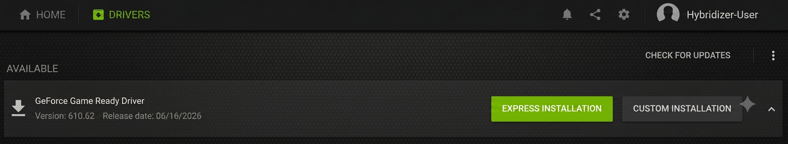

# Setup & Installation

This tutorial gets you from zero to a working Hybridizer environment. By the end, you'll have compiled and run your first GPU-accelerated build.

Hybridizer supports **Windows** and **Linux**, using **.NET 8** (or later).

:::caution
Hybridizer requires **Visual Studio 2022** (with the *Desktop development with C++* workload) to be installed **before** the CUDA Toolkit. If Visual Studio 2022 isn't installed first, the CUDA Toolkit won't work correctly. Only **CUDA Toolkit 13.0** is supported by Hybridizer — see [Step 2](#step-2-install-cuda-toolkit).
:::

## Prerequisites

| Component | Minimum | Recommended |
|-----------|---------|-------------|
| **OS** | Windows 10 x64 / Ubuntu 22.04 | Windows 11 x64 / Ubuntu 24.04 |
| **.NET SDK** | .NET 8.0 | .NET 8.0 (latest patch) |
| **GPU** | Any NVIDIA (Compute ≥ 5.0) | RTX 2060 or newer |
| **RAM** | 8 GB | 16 GB |
| **Disk** | 10 GB free | SSD recommended |

## Step 1: Install NVIDIA Drivers

import Tabs from '@theme/Tabs';
import TabItem from '@theme/TabItem';

<Tabs>
<TabItem value="windows" label="Windows" default>

1. Go to [nvidia.com/drivers](https://www.nvidia.com/drivers) or open **NVIDIA GeForce Experience**

If you use **Geforce Experience** :

2. Find this tab : 



Cliquez sur cet onglet pour accéder à la mise à jour des pilotes.

3. Install with the Express Installation
4. Then verify in the command prompt:

```bash
nvidia-smi
```

5. Be sure to have an output that gives you your GPU name, driver version, and CUDA version, like this:

```Microsoft Windows [Version 10.0.26200.8655]
(c) Microsoft Corporation. All rights reserved.

C:\Users\hybridizer-user>nvidia-smi
Tue Jun 23 10:54:24 2026
+-----------------------------------------------------------------------------------------------+
| NVIDIA-SMI 610.62                     KMD Version: 610.62          CUDA UMD Version: 13.3      |
+-----------------------------------------+-------------------------+---------------------------+
| GPU  Name                 Driver-Model  | Bus-Id           Disp.A | Volatile Uncorr. ECC      |
| Fan  Temp  Perf           Pwr:Usage/Cap |          Memory-Usage   | GPU-Util  Compute M.      |
|                                         |                         |                    MIG M. |
|===============================================================================================|
|   0  NVIDIA GeForce RTX 3050 ...  WDDM  | 00000000:01:00.0 Off    |                  N/A      |
| N/A   48C    P0            749W / 40W   |     0MiB /  6144MiB     |       0%     Default      |
|                                         |                         |                    N/A    |
+-----------------------------------------+-------------------------+---------------------------+

+-----------------------------------------------------------------------------------------------+
| Processes:                                                                                    |
|  GPU   GI   CI        PID   Type   Process name                              GPU Memory       |
|        ID   ID                                                                Usage           |
|===============================================================================================|
|  No running processes found                                                                   |
+-----------------------------------------------------------------------------------------------+
```


</TabItem>
<TabItem value="linux" label="Linux">

Install the recommended driver for your distribution:

```bash
# Ubuntu / Debian
sudo apt update
sudo apt install -y nvidia-driver-560
sudo reboot

# After reboot, verify:
nvidia-smi
```

Alternatively, install via the [CUDA toolkit](#step-2-install-cuda-toolkit) which bundles a compatible driver.

</TabItem>
</Tabs>


## Step 2: Install CUDA Toolkit

/!\ Important information : Hybridizer only works on CUDA Version **13.0** /!\

:::caution
Install the **CUDA Toolkit only** — do **not** install/update the NVIDIA driver from this step. The driver was already installed in [Step 1](#step-1-install-nvidia-drivers); reinstalling it here can lead to version mismatches.
:::

Download from [developer.nvidia.com/cuda-downloads](https://developer.nvidia.com/cuda-13-0-0-download-archive).

<Tabs>
<TabItem value="windows" label="Windows" default>

1. Choose **Windows → x86_64 → exe (local)**
2. Run the installer, and select a **Custom installation** — then **uncheck the "Driver" component**, keeping only the CUDA Toolkit components
3. Verify in the command prompt:

```bash
nvcc --version
```

:::tip
If `nvcc` is not found, add `C:\Program Files\NVIDIA GPU Computing Toolkit\CUDA\v13.0\bin` to your system PATH.
:::

</TabItem>
<TabItem value="linux" label="Linux">

```bash
# Ubuntu 22.04 / 24.04 — network install
wget https://developer.download.nvidia.com/compute/cuda/repos/ubuntu2404/x86_64/cuda-keyring_1.1-1_all.deb
sudo dpkg -i cuda-keyring_1.1-1_all.deb
sudo apt update
sudo apt install -y cuda-toolkit-12-6
```

Add to your shell profile (`~/.bashrc` or `~/.zshrc`):

```bash
export PATH=/usr/local/cuda/bin:$PATH
export LD_LIBRARY_PATH=/usr/local/cuda/lib64:$LD_LIBRARY_PATH
```

Verify:

```bash
source ~/.bashrc
nvcc --version
```

</TabItem>
</Tabs>

Expected output :

```
C:\Users\hybridizer-user>nvcc --version
nvcc: NVIDIA (R) Cuda compiler driver
Copyright (c) 2005-2025 NVIDIA Corporation
Built on Wed_Jul_16_20:06:48_Pacific_Daylight_Time_2025
Cuda compilation tools, release 13.0, V13.0.48
Build cuda_13.0.r13.0/compiler.36260728_0
```

This output doesn't have to be exactly the same, but verify the **release version** is 13.0.

## Step 3: Install .NET 8 SDK

<Tabs>
<TabItem value="windows" label="Windows" default>

Download and install from [dotnet.microsoft.com/download](https://dotnet.microsoft.com/download/dotnet/8.0).

Alternatively, if using Visual Studio 2022 (17.8+), .NET 8 is included with the **.NET desktop development** workload.

</TabItem>
<TabItem value="linux" label="Linux">

```bash
# Ubuntu (via Microsoft packages)
sudo apt install -y dotnet-sdk-8.0

# Or via the install script
curl -sSL https://dot.net/v1/dotnet-install.sh | bash /dev/stdin --channel 8.0
```

Verify:

```bash
dotnet --version    # Should print 8.0.xxx
```

</TabItem>
</Tabs>

## Step 4: Install a C++ Toolchain

Hybridizer generates C++ code that needs to be compiled by `nvcc` and a host C++ compiler.

<Tabs>
<TabItem value="windows" label="Windows" default>

Install **Visual Studio 2022** with the following workloads:
- ✅ **.NET desktop development**
- ✅ **Desktop development with C++** (provides MSVC, needed by `nvcc`)

Or install the [Build Tools for Visual Studio](https://visualstudio.microsoft.com/downloads/#build-tools-for-visual-studio-2022) (lighter, no IDE).

</TabItem>
<TabItem value="linux" label="Linux">

```bash
# GCC (required by nvcc)
sudo apt install -y build-essential

# Verify
g++ --version
```

</TabItem>
</Tabs>

## Step 5: Install Hybridizer

Create a new .NET 8 console project and add the Hybridizer packages by typing this in the terminal :

```bash
dotnet new console -n MyFirstHybridizer --framework net8.0
cd MyFirstHybridizer
dotnet add package Hybridizer.Runtime.CUDAImports
```

You can now close and open Visual Studio.

:::tip
On **Windows with Visual Studio**, you can also install the **Hybridizer Community Edition** extension from the Visual Studio Marketplace for integrated project templates.
:::

## Step 6: Install Git

If you don't already have git, you can install it [here]((https://git-scm.com/install/windows))


## Step 7: Verify Your Setup

Replace the content of `Program.cs` with:

```csharp
using System;
using Hybridizer.Runtime.CUDAImports;

class Program
{
    [EntryPoint]
    public static void TestKernel(int[] output, int N)
    {
        for (int i = threadIdx.x + blockDim.x * blockIdx.x;
             i < N;
             i += blockDim.x * gridDim.x)
        {
            output[i] = i * 2;
        }
    }

    static void Main()
    {
        // Check GPU
        cuda.GetDeviceProperties(out cudaDeviceProp prop, 0);
        Console.WriteLine($"GPU: {new string(prop.name)}");
        Console.WriteLine($"SMs: {prop.multiProcessorCount}");
        Console.WriteLine($"Memory: {prop.totalGlobalMem / (1024*1024)} MB");

        // Run kernel
        int N = 1024;
        int[] output = new int[N];

        dynamic wrapper = HybRunner.Cuda()
            .SetDistrib(32, 256);
        wrapper.TestKernel(output, N);
        cuda.DeviceSynchronize();

        // Verify
        bool ok = true;
        for (int i = 0; i < N; i++)
        {
            if (output[i] != i * 2) { ok = false; break; }
        }

        Console.WriteLine(ok ? "✅ Hybridizer is working!" : "❌ Something went wrong");
    }
}
```

Build and run:

```bash
dotnet build
dotnet run
```

Expected output:

```
GPU: NVIDIA GeForce RTX 4070
SMs: 46
Memory: 12282 MB
✅ Hybridizer is working!
```

Another way to test your setup, in Visual Studio 2022 :

- Open any Visual Studio solution.
- Open a powershell terminal, and clone this Hybridizer samples repository at the place you desire : 

```bash 
git clone https://github.com/hybridizer-io/hybridizer-basic-samples.git 
```

- in the powershell terminal, go to the folder of the sample you want to test with :

```bash
cd C:\Users\Your\Selected\File\hybridizer-basic-samples\src\Your\Sample
```

- Build :

```bash
dotnet build
```

- Run : 

```bash
dotnet run
```

And you will be able to see the output of the sample you have selected. 

You can find some explanations linked to the samples in the [Code Examples](https://docs.hybridizer.io/category/examples/)

## Troubleshooting

| Problem | Solution |
|---------|----------|
| `nvidia-smi` not found | Install/update NVIDIA drivers |
| `nvcc` not found | Reinstall CUDA Toolkit, check PATH |
| `dotnet` not found | Install .NET 8 SDK |
| Build error "Hybridizer not found" | Verify NuGet package: `dotnet list package` |
| Runtime "No CUDA device" | Check GPU with `nvidia-smi`, update drivers |
| `libcudart.so` not found (Linux) | Set `LD_LIBRARY_PATH` to CUDA lib directory |
| DLL not found at runtime (Windows) | Ensure CUDA bin directory is in PATH |
| Compilation errors on Visual Studio | Check your CUDA Version : Only 13.0 is supported |
| `dotnet run` doesn't load | Check your CUDA Version : Only 13.0 is supported |
## Next

You're ready! Proceed to [Your First Kernel →](./first-kernel)